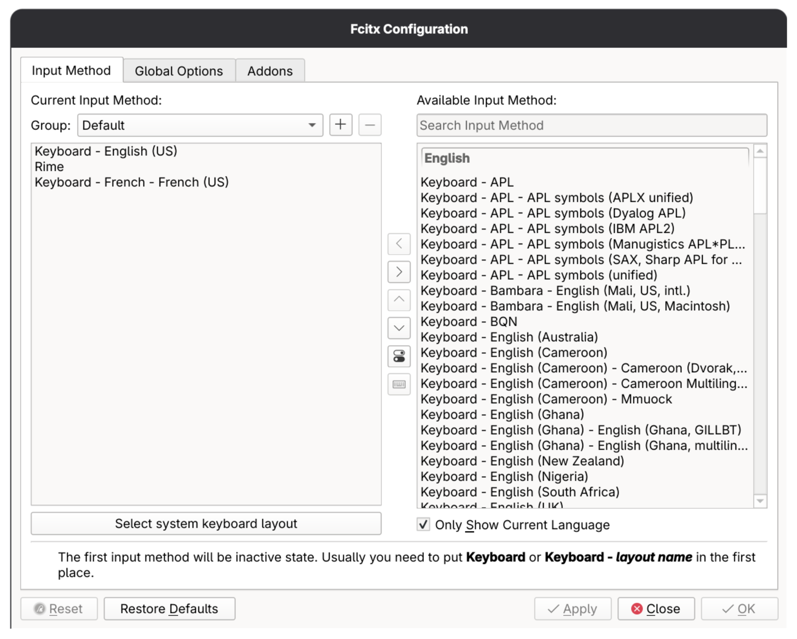
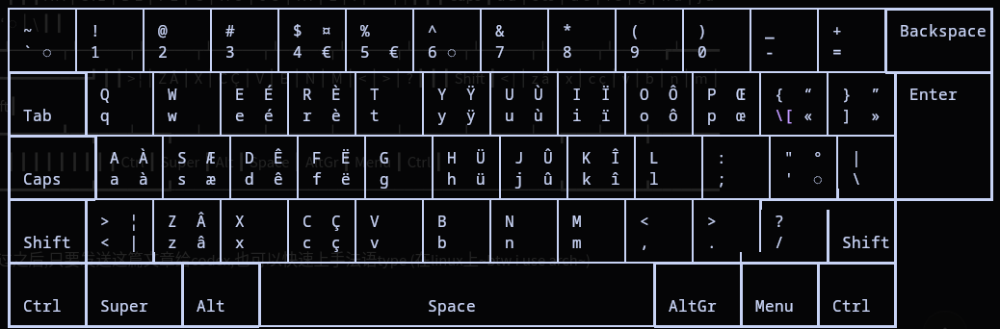

上次写blog还是上次了

---
上次的目标太高远了,一下让我挫败感极大,忘了写文章
文章还是多写好

众所不周知,近期我在学习法语,那么大家和我一样可能会有一个疑问,如何type français 呢?
其实很简单

如图

装好fcitx后直接添加就好了 然后你自己切换一下输入法😄
就这么简单
~~这篇文章属实也简单~~

这段时间应该会猛猛更新,各位敬请期待

ok,但是问题还是没有完美解决,还有一个问题,那我们怎么知道怎么打éèçä这些呢🤔
很简单,问问gemini
然而似乎跟我键盘情况并不一样
故上codex
ok,那么在我的电脑上,相关的配置文件会放在这些地方,以下内容codex直出,有误欢迎指出(xkb, X Keyboard Extension)

/home/nastem/Project/archPostInstall/configs/fcitx5/conf/cached_layouts

  这里能看到 keyboard-fr-us 这个条目的描述：

  [keyboard-fr-us]
  Description="Keyboard - French - French (US)"
  Language=fr
  Label="fr (us)"

  XKB 布局定义
  真正定义 keyboard-fr-us 键位的是：

  /usr/share/X11/xkb/symbols/fr

  对应块是：

  xkb_symbols "us"

  也就是 fr(us) / French (US)。

  它里面还有几个 include：

  include "us(basic)"
  include "eurosign(5)"
  include "level3(ralt_switch)"

  对应文件分别是：

  /usr/share/X11/xkb/symbols/us

  里面的 xkb_symbols "basic" 提供基础 US 键位。

  /usr/share/X11/xkb/symbols/eurosign

  里面的 xkb_symbols "5" 给 5 加 €。

  /usr/share/X11/xkb/symbols/level3

  里面的 xkb_symbols "ralt_switch" 定义右 Alt 作为 AltGr/第三层键。

下面是要codex仿照fr文件当中的好看的键盘图画的,不错,方便查阅

French (US) / fr(us)
┌──────┬──────┬──────┬──────┬──────┬──────┬──────┬──────┬──────┬──────┬──────┬──────┬──────┲━━━━━━━━━━┓
│ ~    │ !    │ @    │ #    │ $  ¤ │ %    │ ^    │ &    │ *    │ (    │ )    │ _    │ +    ┃ Backspace┃
│ ` ◌  │ 1    │ 2    │ 3    │ 4  € │ 5  € │ 6 ◌  │ 7    │ 8    │ 9    │ 0    │ -    │ =    ┃          ┃
┢━━━━━━┷┱─────┴┬─────┴┬─────┴┬─────┴┬─────┴┬─────┴┬─────┴┬─────┴┬─────┴┬─────┴┬─────┴┬─────┺┳━━━━━━━━━┫
┃       ┃ Q    │ W    │ E  É │ R  È │ T    │ Y  Ÿ │ U  Ù │ I  Ï │ O  Ô │ P  Œ │ {  “ │ }  ” ┃ Enter   ┃
┃ Tab   ┃ q    │ w    │ e  é │ r  è │ t    │ y  ÿ │ u  ù │ i  ï │ o  ô │ p  œ │ \[ « │ ]  » ┃         ┃
┣━━━━━━━┻┱─────┴┬─────┴┬─────┴┬─────┴┬─────┴┬─────┴┬─────┴┬─────┴┬─────┴┬─────┴┬─────┴┬─────┨         ┃
┃        ┃ A  À │ S  Æ │ D  Ê │ F  Ë │ G    │ H  Ü │ J  Û │ K  Î │ L    │ :    │ "  ° │ |   ┃         ┃
┃ Caps   ┃ a  à │ s  æ │ d  ê │ f  ë │ g    │ h  ü │ j  û │ k  î │ l    │ ;    │ '  ◌ │ \   ┃         ┃
┣━━━━━━━┳┹─────┬┴─────┬┴─────┬┴─────┬┴─────┬┴─────┬┴─────┬┴─────┬┴─────┬┴─────┲┷━━━━━━┻━━━━━╋━━━━━━━━━┛
┃       ┃ >  ¦ │ Z  Â │ X    │ C  Ç │ V    │ B    │ N    │ M    │ <    │ >    │ ?    ┃      ┃
┃ Shift ┃ <  | │ z  â │ x    │ c  ç │ v    │ b    │ n    │ m    │ ,    │ .    │ /    ┃ Shift┃
┣━━━━━━━╋━━━━━━┻━━┳━━━┷━━━┱──┴──────┴──────┴──────┴──────┴──────┴──┲━━━┷━━━━╈━━━━━━━┳┻━━━━━━┫
┃       ┃         ┃       ┃                                        ┃        ┃       ┃       ┃
┃ Ctrl  ┃ Super   ┃ Alt   ┃                 Space                  ┃ AltGr  ┃ Menu  ┃ Ctrl  ┃
┗━━━━━━━┻━━━━━━━━━┻━━━━━━━┹────────────────────────────────────────┺━━━━━━━━┻━━━━━━━┻━━━━━━━┛

it seems to be a mess, so i place the picture below, an image beats a thousand words

相信大家看过之后,只要发送这篇文章给codex,也可以快速上手法语type (在linux上~~btw i use arch~~)
